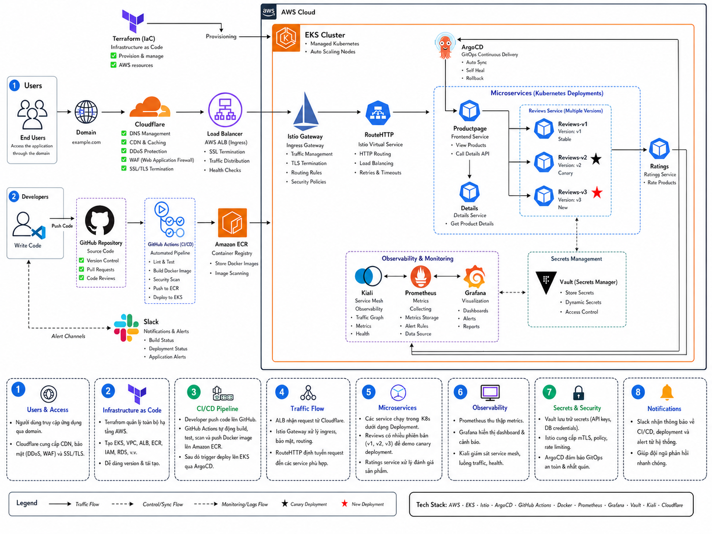

# DevOps on AWS — Workflow & User Access Flow

## Overview

This project deploys the **Bookinfo** microservices application on **Amazon EKS** using a full GitOps-based DevOps stack. This document describes the end-to-end workflow — from a user hitting the domain to how code changes are built, deployed, and observed.

## Architecture



---

## 1. User Access Flow

```
User → Cloudflare (DNS/CDN) → AWS Load Balancer → Istio Gateway → HTTPRoute → Productpage
                                                                                   ├── Details (port 9080)
                                                                                   ├── Reviews-v1 / v2 / v3 (port 9080)
                                                                                   └── Ratings (port 9080)
```

### Step-by-step

| Step | Component | What Happens |
|------|-----------|--------------|
| 1 | **Cloudflare** | User's domain resolves via Cloudflare DNS. Traffic is proxied and protected (DDoS, CDN caching). |
| 2 | **AWS Load Balancer** | Cloudflare forwards to the AWS Load Balancer sitting in front of the EKS cluster. |
| 3 | **Istio Gateway** | The Load Balancer sends traffic to the `bookinfo-gateway` (Istio Gateway API). It listens on port 80/HTTP. |
| 4 | **HTTPRoute** | Istio routes requests matching `/productpage`, `/static`, `/login`, `/logout`, `/api/v1/products` to the **Productpage** service on port 9080. |
| 5 | **Productpage** | The main UI service. It aggregates data from downstream services and renders the page. |
| 6 | **Details** | Called by Productpage to fetch book detail information. |
| 7 | **Reviews** | Called by Productpage. Traffic is split across three versions via weighted HTTPRoute rules. |
| 8 | **Ratings** | Called by Reviews services to fetch star ratings. Ratings-v2 pulls secrets from Vault. |

---

## 2. Traffic Splitting (Canary / Blue-Green)

Istio manages traffic distribution across Reviews versions using weighted `HTTPRoute` rules:

| Route Config | Reviews-v1 | Reviews-v2 | Reviews-v3 |
|---|---|---|---|
| `reviews-v1` only | 100% | — | — |
| `reviews-v1-v2` | 90% | 10% | — |
| `reviews-v1-v3` | 50% | — | 50% |
| `reviews-v2` only | — | 100% | — |
| `reviews-v3` only | — | — | 100% |

- **v1** — No star ratings displayed
- **v2** — Black star ratings
- **v3** — Red star ratings

Switch between routing strategies by applying the appropriate HTTPRoute manifest from [bookinfo/gateway-domain/](bookinfo/gateway-domain/).

---

## 3. CI/CD Pipeline (Developer Flow)

```
Developer → git push (main) → GitHub Actions CI → Amazon ECR
                                                        ↓
                                           GitHub Actions CD → kubectl set image → EKS Deployments
```

### CI Pipeline (`eks-ci.yaml`)

Triggered on every `push` to `main` or `pull_request`.

| Step | Action |
|------|--------|
| Matrix build | Runs in parallel for `productpage`, `reviews`, `ratings`, `details` |
| PR event | Docker **build only** (no push) — validates the image builds correctly |
| Push to main | Docker **build + push** to Amazon ECR (`us-east-1`) |
| Image tags | `<service>-<git-sha>` and `<service>-latest` |

ECR Repository: `prod/devops-on-aws-all-in-one`

### CD Pipeline (`eks-cd.yaml`)

Triggered automatically when CI completes successfully on `main`.

| Step | Action |
|------|--------|
| Condition | Only runs if CI passed on a `push` event to `main` |
| Deployments updated | `productpage-v1`, `details-v1`, `ratings-v1`, `reviews-v1`, `reviews-v2`, `reviews-v3` |
| Update method | `kubectl set image` with the exact `<git-sha>` tag from CI |
| Rollout check | `kubectl rollout status --timeout=180s` — fails the pipeline if rollout hangs |

---

## 4. Secrets Management (HashiCorp Vault)

The `ratings-v2` deployment uses **Vault Agent Injection** to source secrets at runtime.

```
Vault Secret Store → Vault Agent Sidecar → /vault/secrets/config → ratings.js
```

| Detail | Value |
|--------|-------|
| Vault role | `bookinfo-ratings` |
| Secret path | `secret/data/ratings` |
| Injected secret | `APP_MESSAGE` env variable |
| Method | Vault agent injects a shell script to `/vault/secrets/config`; the container `source`s it before starting |
| Auth | Kubernetes ServiceAccount `bookinfo-ratings-v2` |

Vault config files: [bookinfo/platform/vault/](bookinfo/platform/vault/)

---

## 5. Auto Scaling (HPA)

Kubernetes **HorizontalPodAutoscaler** is configured for `productpage-v1`:

| Parameter | Value |
|-----------|-------|
| Min replicas | 1 |
| Max replicas | 5 |
| Scale-up trigger | CPU utilization > 50% |
| Scale-down window | 60 seconds stabilization |

As user traffic increases, Kubernetes automatically scales up Productpage pods to handle load.

---

## 6. Observability Stack

| Tool | Purpose | How It Works |
|------|---------|--------------|
| **Prometheus** | Metrics collection | Scrapes metrics from all pods and Istio sidecars |
| **Grafana** | Dashboards | Visualizes Prometheus metrics (latency, error rate, throughput) |
| **Kiali** | Service mesh topology | Maps live traffic flow between microservices via Istio telemetry |
| **Slack** | Alerting | Receives alerts from Alertmanager / Grafana when thresholds are breached |

---

## 7. Infrastructure Provisioning (Terraform)

All AWS infrastructure is managed as code under [terraform/](terraform/).

| File | What It Provisions |
|------|--------------------|
| `00-*` | Provider versions, variables, local values |
| `01-*` | VPC, subnets, routing |
| `02-*` | IAM roles for EKS cluster and node groups |
| `03-*` | EKS cluster, node group, keypair, outputs |

Environment config: `terraform.develop.tfvars`

---

## 8. GitOps with ArgoCD

ArgoCD runs inside the EKS cluster and watches the Git repository for manifest changes.

- ArgoCD role binding: [bookinfo/platform/argocd/role-argocd.yaml](bookinfo/platform/argocd/role-argocd.yaml)
- When Kubernetes manifests change in Git, ArgoCD automatically syncs the desired state to the cluster.
- This complements the GitHub Actions CD pipeline — CI/CD handles image updates, ArgoCD handles config/manifest drift.

---

## 9. Microservices Summary

| Service | Language | Port | Description |
|---------|----------|------|-------------|
| Productpage | Python | 9080 | Main UI, aggregates all services |
| Details | Ruby | 9080 | Book details (author, pages, etc.) |
| Reviews-v1 | Java | 9080 | Reviews, no star ratings |
| Reviews-v2 | Java | 9080 | Reviews with black stars |
| Reviews-v3 | Java | 9080 | Reviews with red stars |
| Ratings | Node.js | 9080 | Star rating data |
| MongoDB | — | 27017 | Backend for ratings-v2 |
| MySQL | — | 3306 | Alternative backend for ratings |

---

## 10. Full End-to-End Summary

```
[Terraform] ──────────────────────────────────────────────► AWS Infrastructure (VPC, EKS, IAM)
                                                                        │
[Developer] ──► GitHub Push ──► GitHub Actions CI ──► Amazon ECR       │
                                        │                               │
                                GitHub Actions CD ──► kubectl ──────────┤
                                                                        │
                                        ArgoCD (GitOps sync) ──────────►│
                                                                        │
[User] ──► Cloudflare ──► Load Balancer ──► Istio Gateway ──► EKS Pods ─┘
                                                  │
                                    Prometheus / Grafana / Kiali (observe)
                                                  │
                                              Slack (alert)
```
